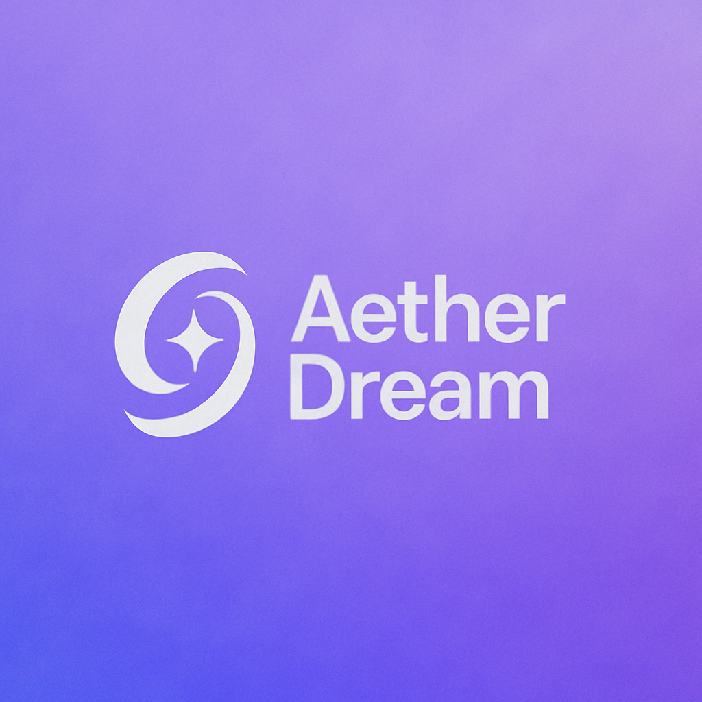

<p align="center">
  
</p>
<h1 align="center">AetherDream</h1>
<p align="center"><strong>The World's First Dreamer-Inspired Multi-Agent AI System for Human-Level Communication</strong></p>
<p align="center">
AetherDream isn't just an email tool. It's the <em>first-of-its-kind</em> AI system that <strong>imagines, drafts, refines, and evolves</strong> your messages through a multi-agent architecture — inspired by DreamerV3-style learning and built on top of today's most powerful language models.
</p>

<p align="center"><em>"We don't just generate. We imagine before we write."</em></p>

---
## 🌌 What Makes AetherDream a World-First?
Most AI assistants generate a single message.  
**AetherDream imagines multiple variations** — like a human would — and then evaluates, refines, and chooses the best one using a self-organizing pipeline of intelligent agents.
It's the **first system to combine**:
- A **modular agent chain** (Analyzer → Generator → Refiner → Evaluator)
- **Multi-draft reasoning** with quality scoring
- **Style learning feedback loop**
- Compatibility with **any LLM API** (OpenAI, Claude, Gemini, etc.)
> The result: a message that doesn't just sound smart — it feels like *you* wrote it at your best.
---
## 🧠 Key Capabilities
- 🔍 **Intent Analyzer**  
  Understands user context, tone, emotion, and goals.
- 🧠 **Multi-Dream Generator**  
  Produces multiple message drafts via LLMs using creative sampling.
- 🛠 **Refiner Agent**  
  Improves structure, tone, and clarity while maintaining user voice.
- ✅ **Evaluator Agent**  
  Scores and selects the strongest version from multiple drafts.
- 🔁 **Memory Engine**  
  Learns from user edits and feedback to evolve communication style over time.
---
## 🛠 Tech Stack
| Layer           | Technology                          |
|------------------|--------------------------------------|
| Language APIs     | OpenAI · Claude · Gemini · Grok      |
| Backend           | Python · FastAPI                     |
| Orchestration     | Modular Multi-Agent Architecture     |
| Memory Layer      | Redis · Supabase/Firebase (optional) |
| Frontend (optional) | React · Framer · SwiftUI           |
---
## 📁 Project Structure
```bash
AetherDream-AI/
├── README.md
├── LICENSE
├── .gitignore
├── requirements.txt
├── docker-compose.yml
│
├── assets/
│   └── logo.png
│
├── src/
│   ├── main.py              # FastAPI entry point
│   ├── config.py            # Configuration settings
│   ├── pipeline.py          # Agent pipeline controller
│   ├── api/
│   │   ├── routes.py        # API endpoints
│   │   └── models.py        # Pydantic models
│   │
│   ├── agents/
│   │   ├── analyzer.py      # Intent analysis
│   │   ├── generator.py     # Multi-draft generator
│   │   ├── refiner.py       # Message refinement
│   │   └── evaluator.py     # Quality evaluation
│   │
│   ├── memory/
│   │   ├── feedback_memory.py # User feedback learning
│   │   └── style_memory.py  # Style profile management
│   │
│   ├── llm/
│   │   ├── provider_factory.py # LLM provider factory
│   │   └── providers/      # API integrations
│   │
│   └── utils/
│       ├── logger.py        # Structured logging
│       └── metrics.py       # Performance tracking
│
├── prompts/
│   ├── analyzer/
│   │   └── intent_analyzer.md
│   ├── generator/
│   │   └── dream_generator.md
│   ├── refiner/
│   │   └── refiner_agent.md
│   └── evaluator/
│       └── evaluator.md
│
├── tests/
│   └── test_pipeline.py
│
└── docs/
    ├── architecture.md     # System architecture
    └── api_reference.md    # API documentation
```
---
## 🚀 Getting Started
```bash
# Clone the repository
git clone https://github.com/koushikjaladi/AetherDream-AI.git
cd AetherDream-AI

# Install dependencies
pip install -r requirements.txt

# Set up environment variables
cp .env.example .env
# Edit .env with your API keys

# Run the development server
python -m src.main
```
---
## 📖 Example Usage
```python
from aetherdream import Pipeline

# Initialize the pipeline
pipeline = Pipeline()

# Process a message
result = await pipeline.process(
    message="Draft an email to our clients about the new product launch",
    context={
        "style": "professional",
        "audience": "enterprise clients",
        "goal": "generate excitement"
    }
)

print(result.best_draft)  # Print the best draft selected
```
---
## 👨‍🚀 Creator

**Koushik Jaladi**  
AI Product Architect · Prompt Engineer  
[LinkedIn](https://linkedin.com/in/koushikjaladi) · [Twitter/X](https://x.com/koushikjaladi)
“We don’t just generate. We imagine before we write.”

---
## 📄 License
This project is licensed under the MIT License - see the [LICENSE](LICENSE) file for details.
